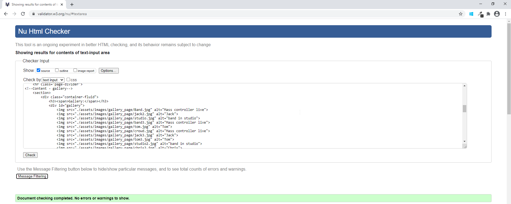
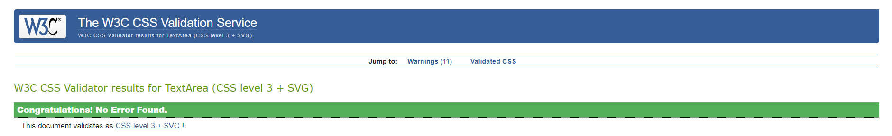

# Mass Ctrlr - Band Website (Testing section)

## Table of contents

1. [User Stories Testing](#user-stories-testing)
2. [Code Validation](#code-validation)
3. [Functionality Testing](#functionality-testing)
4. [Performance Testing](#performance-testing)
5. [Encountered Issues](#encountered-issues)

## User Stories Testing

### Visitor Stories

1.	As a site visitor, I would like to learn more about the band, their members, musical style and their history.
    - On the landing page, a visitor can immediately find a brief information about the band, the band members and about their musical style. In the text the user is appropriately invited to click to ‘check out’ the band’s music page for more information on gigs and to hear they’re music. The user will be redirected to these pages where he/she will be able to find more information. Also, these pages are easily accessible from the top navigation bar.
2.	As a site visitor, I would like to easily navigate through the site and find what I'm looking for with an ease.
    - From the navigation bar, a user can easily access all other pages.
    - The website has a responsive navigation bar, it collapses on small and medium devices to navbar-toggler-icon (hamburger menu) which gives the user an opportunity for easy access to all pages on mentioned devices.
    - There are visual prompts on the navigation bar to inform the user of which page of the website they are currently on and on hovering over the other navigation bar links where they can navigate to next.
3.	As a site visitor, I would like to be able to easily find links to the band’s music and social media pages so I can follow the band on there as well.
    - From the footer bar, which is consistent on all of the pages, the user can clearly see icons representing the different social media and music streaming pages for the band.
    - The music streaming pages are also linked on the main content of the ’Music’ page in reference to the band’s latest single.
    - The band’s facebook can also be found through the video’s embedded on the music page, giving the user another opportunity to connect on Facebook.
    - All external links open in a new browser tab/window so that the user doesn’t navigate away from the Mass Ctrlr website.
4.	As a site visitor, I would like to be able to contact the band to book them for gigs or find out more information.
    - On the navigation bar there is a link to "Contact Us" page where a site visitor can fill and submit a contact form.
    - From the footer bar, which is consistent on all of the pages, there is a prompt for the user to get in touch with the band for bookings and more information. A visual icon is also provided to make the prompt stand out more. The link takes the user to the ‘Get in touch’ page, where they can fill in a form.
    - The form on the ‘Get in touch’ page has required fields so that all necessary information is completed before submitting the form.
    - The site visitor also has an option to contact the company via social media links located at the bottom footer on all webpages.
5.	As a site visitor, I would like that the website is responsive on all screen sizes.
    - By using the mobile-first design, the website was built to be fully responsive.
    - I have tested the website using different devices options on the chrome developer tools, as well as my own personal devices (Samsung A70, Apple ipad and desktop computer)

### Business Stories

1.	As a business owner, I would like to have the website that is elegant, simple and easy to use.
    - The website's structure is clearly defined, meaning the website content is grouped, linked and clearly presented to a site visitor.
    - The website has clear navigation at the top of all webpages as well as clear navigation paths within webpages.
    - There are visual prompts on the navigation bar to inform the user of which page of the website they are currently on and on hovering over the other navigation bar links where they can navigate to next.
    - The footer is consistent across all pages and has icons to visually prompt the user to visit external social media and music streaming pages.
    - All links have been tested to assure they work and all external links open in a new browser window/tab to ensure the user doesn’t navigate away from the website.
    - All colors used tie in with the band’s current logo so is consistent with the band’s brand.
    - The visitor is able to get the information they need quickly and easily.
    - The website is built by using the mobile-first design and as such is fully responsive and has better compatibility between different screen sizes.
    - Attractive images were used throughout the website
2.	As a business owner, I want the website users to be able to find information about the band easily.
    - The website has clear navigation at the top of all webpages as well as clear navigation paths within webpages.
    - The landing page has information about the band, band members and musical style/influences.
    - The footer is consistent across all pages and has icons to visually prompt the user to visit external social media and music streaming pages where even more information can be found.
    - The footer, on all pages, has a prompt for the user to go to the ‘Get in touch’ page where they can fill in the form for more information if necessary.
3.	As a business owner, I want the website to be a central hub for information and content with links to all social media and music streaming pages.
    - The footer is consistent across all pages and has icons as links to visually prompt the user to visit external social media and music streaming pages where even more information can be found.
    - The ‘Music’ page has information about their latest song with links to the music streaming pages.
    - The ‘Music’ page also has videos which have been embedded from facebook which provides another opportunity for users to access the band’s facebook page.
4.	As a business owner, I would like to expand our existing fan base.
    - Before launching the website, the business owner was present only on social media platforms (Facebook and Instagram). With the website launching he will have the wider audience and opportunity to connect with new fans.
5.	As a business owner, I would like for the users to have an option to enquire about booking the band for a gig or to gain more information.
    - On the navigation bar there is a link to "Contact Us" page where a site visitor can fill and submit a contact form.
    - From the footer bar, which is consistent on all of the pages, there is a prompt for the user to get in touch with the band for bookings and more information. A visual icon is also provided to make the prompt stand out more. The link takes the user to the ‘Get in touch’ page, where they can fill in a form.
    - The form on the ‘Get in touch’ page has required fields so that all necessary information is completed before submitting the form.
    - The site visitor also has an option to contact the company via social media links located at the bottom footer on all webpages.
6.	As a business owner, I would like to increase gig bookings and other opportunities.
    - Before launching the website, the business owner was present only on social media platforms (Facebook and Instagram). With the website launching they will have the wider audience and another opportunity for bookings via the contact page (once this is set up with an email address associated with the band)

[Back to table of contents](#table-of-contents)

## Code Validation

Every page of the project was validated by the [W3C Markup Validation Service](https://validator.w3.org/#validate_by_input) to ensure there were no syntax errors or issues.
[W3C CSS Validation Service](https://jigsaw.w3.org/css-validator/#validate_by_input) was used to validate CSS code.

### W3C Markup Validation Service

#### Home page

No errors for home page.

#### Music page

A warning and error came up on the music page (see screenshot below) both were from the embedded code for the apple music player. I removed the code highlighted in the validator and will check the player still functions correctly.

.png)

After checking Functionality after removing the code, the apple music player would not show - I added back in the "allow-same-origin" attribute as this was only a warning rather than an error. Adding this back in fixed the issue of the player no longer showing.

#### Gallery page

No errors for Gallery page.

#### Contact page

No errors for Contact page.

### W3C CSS Validation Service

[Back to table of contents](#table-of-contents)

## Functionality Testing

- Feature testing on each page.
- Checked for broken links and that all external links open in a new browser tab.
- Checked the responsive layout worked as intented, using both chrome developer tools and my own personal devices.
- Checked that the contact form worked.
- Asked friends to test out website also.

### Browser Testing

The website was tested on the following browser types. All browser versions were up to date.
- Google chrome
- Windows Internet explorer
- Safari
- Samsung Internet
- Google chrome for Android

The website is fully functioning and fully responsive on all above mentioned browsers.

### Device Testing

For all my media queries, I used the following page for help on [standard device sizes](https://css-tricks.com/snippets/css/media-queries-for-standard-devices/)

The website was tested on the following devices:
- Samsung Galaxy A70
- Apple iPad

The site has been tested on friend's devices also which include iphones however without overseeing the testing myself due to lockdown I have not included these in my testing document.

I have tested other devices using the chrome developer tools including:
- Moto G4
- Galaxy S5
- Pixel 2 / Pixel 2 XL
- iPhone 5 / SE / 6 / 7 / 8 (incl Plus options) / X
- iPad / iPad Pro
- Surface duo

The website is platform-cross compatible and has a consistant result.

[Back to table of contents](#table-of-contents)

## Performance Testing

Using lighthouse on Google Chrome developer tools.

Initially 'the best practice result' was in amber due to external links not having rel=”noopener” - [explanation for why best practice](https://web.dev/external-anchors-use-rel-noopener/). My mentor took the photo and shared it over slack, I did not take a picture of this myself.

After dealing with these warnings this is now the results of the Lighthouse report for the website.

[Back to table of contents](#table-of-contents)

## Encountered Issues

- After deploying my website on Github pages, I noticed that the images that had worked on previews ob my workspace, no longer worked.
    - for images within html files I added . infront of the /assets/ filepath to fix this issue.
    - for images within the style.css file I added .. infront of the /images/ filepath to fix this issue.

- After checking functionality after removing the code highlighted during the music page validation exercise, the apple music player would not show - I added back in the "allow-same-origin" attribute as this was only a warning rather than an error. Adding this back in fixed the issue of the player no longer showing.

- For some reason the facebook embedded videos disappeared from browsers after fixing the issue above. Unclear as to the reason as I had not changed any of that code. 
    - checked embedded code again, re-added to ensure most recent code was added. Re-checked on all personal devices.

[Back to table of contents](#table-of-contents)

